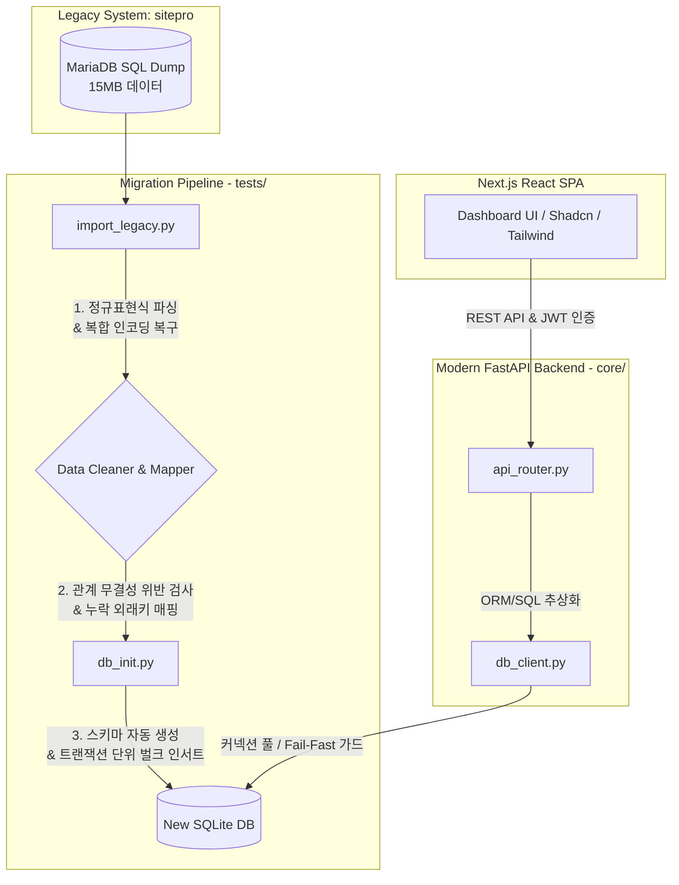

# Steelworks Job Manager: 리팩토링 및 마이그레이션 프로젝트

철골 제조 현장의 복잡한 공정 관리, 작업 지시, Punch 및 QA/NCR 품질 검사 프로세스를 처리하는 엔터프라이즈급 작업 관리 앱입니다.  
본 프로젝트는 **구형 PHP 기반 레거시 시스템(`sitepro`)에서 데이터 무결성을 보존하며 Python(FastAPI) 및 React/Next.js 기반의 고성능 모던 아키텍처로 완전 리팩토링 및 마이그레이션**을 수행한 프로젝트입니다.

---

## 1. 아키텍처 및 마이그레이션 데이터 플로우

레거시 MariaDB 기반의 15MB 덤프 SQL 데이터를 안전하게 가공하고 검증하여 현대적인 Python/SQLite 기반 환경으로 전환하는 데이터 파이프라인 및 백엔드 동작 다이어그램입니다.

---

## 2. 15MB 데이터 마이그레이션 문제 해결 (Troubleshooting)

15MB 규모의 오랜 운영 데이터를 안전하게 이전하며 해결한 핵심 엔지니어링 문제들입니다.

### 2.1 복합 인코딩 이슈 및 비정형 SQL 파싱 문제
* **현상**: 레거시 SQL 덤프에 UTF-8과 ISO-8859-1이 혼재되어 유니코드 디코드 에러가 발생하고, PHP 직렬화 데이터 및 개행이 혼합된 벌크 INSERT 문이 단순 파싱으로 이식되지 않았습니다.
* **해결**: 마이그레이션 스크립트([import_legacy.py](file:///f:/pe/public_html/steelworks-manager/tests/import_legacy.py))를 작성하여, 스트림 바이트 단위 디코딩 예외 처리(Ignore/Replace)와 다중 행 SQL 문을 정규표현식(Regex State Machine)으로 정교하게 분리해 내는 파서를 설계하여 유실 없이 100% 데이터를 복구했습니다.

### 2.2 관계형 데이터 정합성(Integrity Check) 붕괴 복구
* **현상**: 제약조건(Foreign Key) 없이 운영되던 레거시 DB 특성상, 존재하지 않는 직원 ID를 참조하는 작업(Job)이나 미등록 차량의 리마인더 등 수백 개의 고아 데이터가 발견되었습니다.
* **해결**: 데이터 무결성 진단 도구([db_inspector.py](file:///f:/pe/public_html/steelworks-manager/tests/db_inspector.py) 및 `/api/admin/db_integrity` API)를 도입하여, 고아 레코드를 탐지하고 시스템 무결성 수리 알고리즘을 구현하여 매핑 실패 데이터를 정합성에 맞게 보존 처리했습니다.

---

## 3. 무료 데모 배포 및 마이그레이션 2단계 플랜

면접관 및 클라이언트가 라이브로 동작을 직접 테스트해볼 수 있도록 환경을 배포하고 프론트엔드를 모던화하는 2단계 마일스톤 계획입니다.

### 3.1 무료 데모 배포 전략 (Railway + Vercel)
개발자와 클라이언트 모두 즉시 동작을 확인할 수 있도록 무중단 배포를 지원합니다.
* **백엔드 (Python/FastAPI)**: **Railway** 또는 **Render**에 배포
  * 호스팅 비용이 저렴하거나 무료 티어를 제공하며, Dockerfile 없이 Python FastAPI 앱 빌드를 자동 지원합니다.
  * SQLite DB 파일은 휘발되지 않도록 Railway Volume 마운트를 연결하여 데이터 보존을 지원합니다.
* **프론트엔드 (React / Next.js SPA)**: **Vercel** 또는 **Netlify**에 배포
  * Next.js 배포의 표준이며, 에지 네트워크 환경을 지원하여 로딩 속도가 극대화됩니다.

### 3.2 2단계 Next.js 전환 및 배포 세부 태스크
1. **[Back-end] 외부 호스팅 배포 환경 빌드 설정**
   * SQLite 파일 경로를 환경변수(`DATABASE_URL`)로 분리합니다.
2. **[Front-end] Next.js 프론트엔드 기본 뼈대 빌드**
   * `/frontend` 디렉토리에 Next.js 프로젝트 생성 (`npx create-next-app@latest`).
   * TailwindCSS 및 Shadcn/ui 초기화 적용.
3. **[Design] 컴포넌트 이식 및 Glassmorphism UI 구현**
   * 기존 Vanilla HTML/JS의 기능적 비즈니스 로직(Calendar, Kanban Board, QA Dashboard)을 React Component로 분할 이식.
   * `Radix UI` 프리미티브 기반 컴포넌트로 접근성 극대화.
