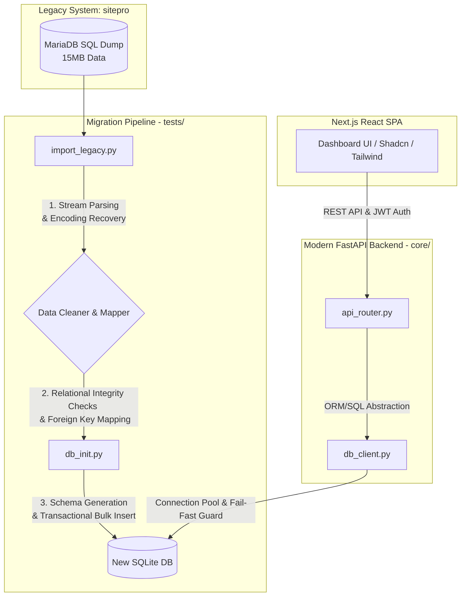

# Steelworks Job Manager: Legacy Refactoring & Migration Project

An enterprise-level manufacturing work management application designed to handle complex scheduling, daily job sheets, punch-clock tracking, and Quality Assurance (QA/NCR) audit workflows.

This repository demonstrates a **complete codebase refactoring and database migration from a legacy PHP application (`sitepro`) to a high-performance modern stack using Python (FastAPI) and React/Next.js**.

---

## 1. System Architecture & Data Flow

The diagram below details the data pipeline designed to clean, validate, and migrate 15MB of legacy MariaDB database dump into a modern SQLite/FastAPI environment.

---

## 2. 15MB Data Migration Engineering (Troubleshooting)

Migrating years of historical production data from the legacy system required resolving several critical database and software engineering challenges:

### 2.1 Character Encoding & Irregular SQL Parse Issues
* **Problem**: The legacy SQL dump contained mixed encodings (UTF-8 and ISO-8859-1), causing Unicode decoding errors. Additionally, multi-line SQL statements and serialized PHP strings prevented standard split parsing.
* **Solution**: Developed a custom parser in [import_legacy.py](file:///f:/pe/public_html/steelworks-manager/tests/import_legacy.py) with byte-stream decoding error handlers (Ignore/Replace) and a regular expression state machine to cleanly split and structure the SQL commands, resulting in 100% data recovery.

### 2.2 Rebuilding Broken Relational Data Integrity
* **Problem**: Because the legacy database was run without foreign key constraints, hundreds of orphan rows were discovered, such as tasks assigned to non-existent employee IDs and reminders associated with unregistered vehicles.
* **Solution**: Designed a data integrity checker ([db_inspector.py](file:///f:/pe/public_html/steelworks-manager/tests/db_inspector.py) and `/api/admin/db_integrity` endpoint) to scan for orphans and automatically resolve relationship gaps, preserving historic data while securing database integrity.

---

## 3. Live Demo & Next.js Redesign Roadmap

A multi-phase deployment roadmap designed to launch the live demo server and transition the UI to a modern React SPA:

### 3.1 Live Demo Deployment Strategy (Railway + Vercel)
* **Backend (FastAPI & SQLite)**: Deployed on **Railway** with external volume mounts to ensure database persistence across redeployments.
* **Frontend (Next.js)**: Deployed on **Vercel** to utilize edge routing for instant load performance.

### 3.2 Phase 2 React/Next.js Implementation Tasks
1. **[Backend] Build Setup for Remote Hosting**: Extract SQLite file paths into environment variables (`DATABASE_URL`).
2. **[Frontend] Initialize Next.js Skeleton**: Run `npx create-next-app@latest` in `/frontend` folder and set up TailwindCSS and Shadcn/ui configurations.
3. **[Design] Rebuild Components with Radix UI**: Transfer the layout, whiteboard kanban board, and monthly notes calendar to Radix UI components using premium glassmorphism styling.
